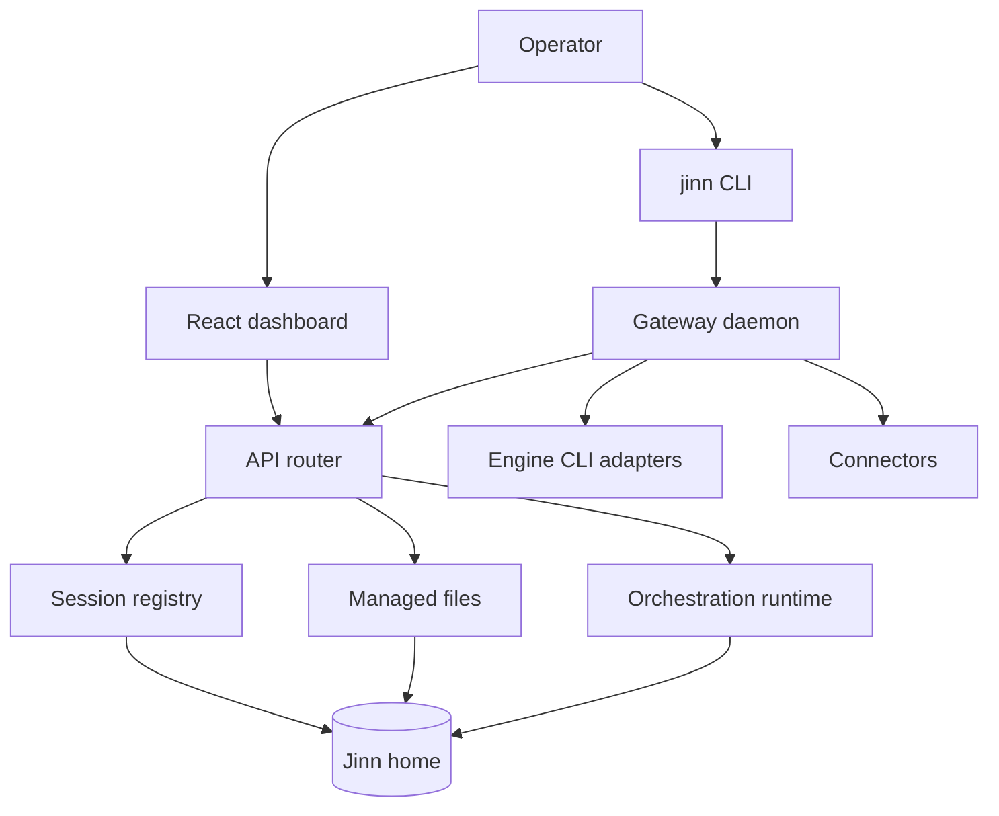
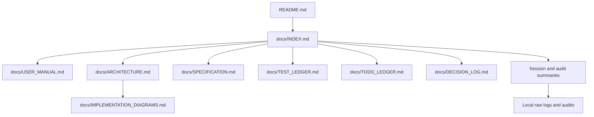
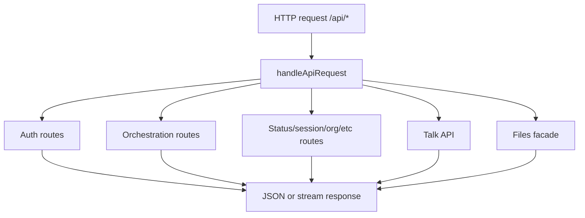

# Implementation Diagrams

## Runtime Component Map

Evidence: `README.md`, `packages/jinn/bin/jinn.ts`, `packages/jinn/src/gateway/api.ts`,
`packages/web/src/main.tsx`, `packages/jinn/src/sessions/`, `packages/jinn/src/engines/`.

## Documentation Map

Evidence: `docs/INDEX.md`, `AGENTS.md`, `docs/LOG_ARCHIVE.md`.

## API Routing Flow

Evidence: `packages/jinn/src/gateway/api.ts`, `packages/jinn/src/gateway/api/orchestration-routes.ts`,
`packages/jinn/src/gateway/files.ts`, `packages/jinn/src/talk/routes.ts`.
