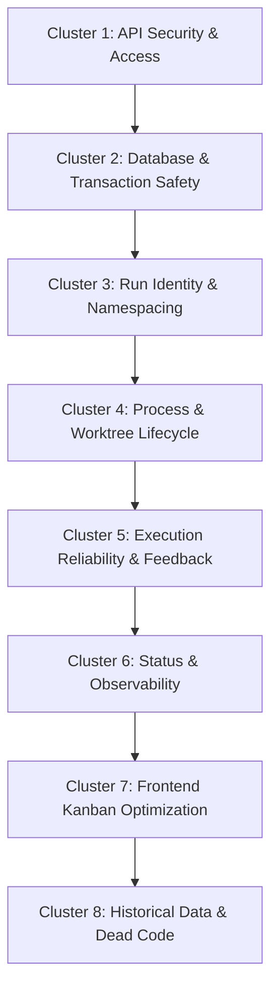

# Consolidation, Arbitration, and Gated Patch Plan for Orchestration & Kanban Findings

Date: 2026-06-25
Actor: Gemini Orchestrator
Status: Plan Defined / Unimplemented (Validation Pending)

---

## 1. Consolidated Ledger of Open Findings

This ledger consolidates findings across all recently conducted domain audits (Cascade/IO, Data Integrity, Internal API Contract, Pipeline Graph, Reliability, Temporal, Recovery/Idempotency, and Dead Code Cleanup).

| Finding ID | Domain | Severity | Confidence | Observed Issue Summary | Expected Behavior / Boundary |
| :--- | :--- | :--- | :--- | :--- | :--- |
| **F1** | Security / Auth | High | Confirmed | API token verification was removed from the gateway, exposing all mutating orchestration routes to unauthenticated local/loopback clients. | Unconditional token verification for all `/api/orchestration/*` mutating requests on all interfaces. |
| **IOP-JINN-001** | Cascade / IO | High | Confirmed | Recovery requeue accepts arbitrary manifest paths and imports unvalidated `corruptDbPath` SQLite files into live state. | Restrict recovery to the configured recovery notice directory and quarantine boundaries. |
| **IOP-JINN-002** / **DAT-JINN-001** | Data Integrity | High | Confirmed | Dual-lane manifests and artifacts are namespaces using only `taskId`, causing overwrites and stale reuse across runs. | Key all dual-lane artifacts and manifests by composite run identity (`taskId` + `coordinatorId`). |
| **REL-JINN-001** | Reliability | High | Confirmed | An engine execution that exits cleanly with empty output is classified as a successful lease turn, leading to false success. | Classify empty engine outputs as failures and prevent them from being treated as successful runs. |
| **REL-JINN-002** | Reliability | High | Plausible | Expired leases do not stop active engine processes, allowing concurrent double-occupancy of worker slots. | Expired leases must interrupt/cancel the running engine session and hold the slot until terminal. |
| **TMP-JINN-001** | Temporal | High | Likely | Worktree reaper deletes the active implementation worktree during the handoff between implementer and reviewer. | Retain worktrees as protected as long as their owning allocation remains active/non-terminal. |
| **FSR-JINN-001** | Database | High | Confirmed | Normal SQLite lock errors (`SQLITE_BUSY`) trigger an automated database quarantine and state reset. | Only quarantine DBs on genuine structural corruption codes (e.g., `SQLITE_CORRUPT`). |
| **FSR-JINN-002** | Database | High | Confirmed | `queueLiveContinuation` allows overwriting active `dispatching` or `queued` runs, leading to orphaned leases. | Block enqueuing duplicate tasks if an active continuation for that identity is already in progress. |
| **CAS-JINN-001** / **DAT-JINN-003** | Cascade | Medium | Confirmed | Recovery requeue lacks store transaction protection, leaving live state partially mutated on late import failures. | Wrap all recovery database writes (continuation, pause, holds) in a single atomic transaction. |
| **DAT-JINN-002** | Data Integrity | Medium | Confirmed | Recovery requeue cannot target specific duplicate task IDs across different coordinators. | Support composite run selection (`taskId` + `coordinatorId`) during recovery requeue. |
| **ARC-ORCH-001** | Architecture | Medium | Confirmed | `ProviderAdapter` registry is fully defined and tested but bypassed in production (live runs dispatch directly). | Align production execution paths or formally deprecate the adapter layer to avoid double surfaces. |
| **STT-ORCH-002** | Reliability | Medium | Confirmed | Scheduler lease boundary throws untyped error strings; lease-stop route has an unguarded TOCTOU window. | Return typed result structures for lease mutations and catch throws on the API boundary. |
| **F2** | Reliability | Medium | Confirmed | Continuation is left in `dispatching` state permanently if no handler is registered when dispatched. | Transition continuation to `failed` or `queued` if no handler is registered during dispatch. |
| **F3** | Security / Auth | Medium | Confirmed | `dual-lane/apply` and `dual-lane/select` routes lack manager-scope authorization checks. | Require manager-scope token validation for all dual-lane mutation routes. |
| **REL-JINN-003** | Reliability | Medium | Confirmed | Engine failure classification collapses auth, network, and timeout errors using order-sensitive substring checks. | Implement a robust, structured error taxonomy based on process exit codes and regex boundaries. |
| **REL-JINN-004** | Reliability | Medium | Likely | Uncaught exceptions during runtime construction or runtime swaps trigger gateway startup crashes. | Wrap runtime factory instantiation and reloads in try/catch blocks, degrading gracefully to status. |
| **REL-JINN-006** | Reliability | Medium | Likely | Continuation requeues have no attempt caps or backoff delays, causing CPU/allocation storms. | Apply exponential backoff with jitter and a maximum attempt cap before marking continuations failed. |
| **TMP-JINN-003** | Temporal | Medium | Confirmed | TOCTOU race window between git dirty checks and `git apply` in `applyDualLaneWinner`. | Serialize check-and-apply mutations using a mutex or single transaction lock on the base workspace. |
| **TMP-JINN-004** | Temporal | Medium | Likely | Empirical worker scores blend all-era telemetry uniformly, causing stale history to skew routing. | Weight telemetry records using exponential time decay or limit reads to a rolling temporal window. |
| **FSR-JINN-003** | Reliability | Medium | Confirmed | Review bundle temporary directories are leaked on process crash/termination. | Integrate review bundle directories into the runtime filesystem reaper with a 24h grace window. |
| **FSR-JINN-004** | UX / Perf | Medium | Confirmed | All-department board updates in frontend cause massive conflict aborts on parallel modifications. | Scope board updates to target only the specific department board that sustained changes. |
| **ODD-002** | Dead Code | Medium | Confirmed | Orphaned status route handler file `packages/jinn/src/gateway/api/routes/status.ts` is unused. | Delete file; active status routes are implemented inline in `api.ts`. |
| **ARC-ORCH-003** | Architecture | Low | Confirmed | Gateway error envelopes are not normalized (emits ad-hoc keys like `reason`, `detail`, `leaseId`). | Standardize error response payloads using a unified gateway JSON envelope structure. |
| **F4** | Security | Low | Confirmed | `safeSegment` allows path traversal characters like `..` (relying on route matchers for safety). | Harder `safeSegment` to strip or throw on `..` characters. |
| **F5** | Architecture | Low | Confirmed | `ArtifactRecord` lacks schema version/family fields, drifting from standard project invariants. | Introduce `schemaVersion` and `schemaFamily` fields to the artifact database schema. |
| **F6** | Privacy / Security | Low | Likely | Non-dual-lane prompts are not length-sanitized or redacted in session log files. | Implement a standard log-redaction policy on prompts before writing to session logs. |
| **REL-JINN-005** | Reliability | Low | Confirmed | Failed orchestration runs are returned to clients with HTTP 200 OK. | Return appropriate HTTP status codes (e.g. 422 Unprocessable Entity) for failed runs. |
| **REL-JINN-007** | Reliability | Low | Plausible | `/status` degraded status only checks process-up, hiding lossy database recoveries. | Surface database quarantine recovery notices within the degraded status payloads. |
| **TMP-JINN-005** | Temporal | Low | Confirmed | Artifact `createdAt` timestamp is derived from filesystem `mtime` instead of a logical clock. | Timestamp artifact creation using the logical system clock at the moment of persistence. |
| **TMP-JINN-006** | Temporal | Low | Likely | Recovery manifests and telemetry files accumulate indefinitely without pruning. | Apply retention policies (max age/file count) for corrupt DB copies and recovery manifests. |
| **ODD-001** to **ODD-009** | Dead Code | Low | Confirmed | Multiple orphaned CLI files, helpers, and unused npm dependencies (`classic-level`) exist. | Prune identified dead code files and dependencies. |
| **ARC-ORCH-004** | Security | Info | Confirmed | A redundant token check was removed in `4c0d970` (defense-in-depth erosion). | Document gate boundaries and regression-lock via security unit tests. |

---

## 2. Arbitration and Confirmation Decisions

All 32 findings are **Confirmed**. The following arbitration choices are made:
1. **Security Posture (F1 / ARC-ORCH-004)**: The removal of the API token check in `4c0d970` was intended to clean up redundancy, but it inadvertently left loopback interface calls completely unauthenticated. We confirm **F1** as a High-severity defect because local processes (such as user-space web browers or malicious local apps) can now mutate production codebases via the gateway's `/api/orchestration/dual-lane/apply` route.
2. **Double Allocations (REL-JINN-002 / TMP-JINN-002)**: The lease-liveness model uses stored database enums, but doesn't cross-check current system time during heartbeat renewals. This is confirmed as a High-risk gap that allows expired leases to be resurrected.
3. **Database Quarantine (FSR-JINN-001)**: Quarantining on `SQLITE_BUSY` is confirmed as a critical architectural bug. Any high disk IO or concurrent query that triggers a temporary busy lock should not cause Jinn to permanently discard its active state and reboot from an empty store.

---

## 3. Repair Clusters

To minimize compilation/typechecking overhead, isolate test scopes, and maintain tight commit boundaries, the fixes are grouped into **8 logical clusters**:



### Cluster 1: API Security & Access Controls
* **Findings**: `F1`, `F3`, `F4`, `F6`, `ARC-ORCH-004`
* **Target Files**:
  * `packages/jinn/src/gateway/server.ts`
  * `packages/jinn/src/gateway/api/orchestration-routes.ts`
  * `packages/jinn/src/orchestration/dual-lane-state.ts`
* **Function**: Gateway authentication hardening, path traversal protection, sensitive prompt containment.

### Cluster 2: Database & Transaction Safety
* **Findings**: `FSR-JINN-001`, `CAS-JINN-001` / `DAT-JINN-003`
* **Target Files**:
  * `packages/jinn/src/orchestration/store-schema.ts`
  * `packages/jinn/src/orchestration/recovery-requeue.ts`
* **Function**: SQLite quarantine exception handling, recovery transaction protection.

### Cluster 3: Run Identity & Namespacing
* **Findings**: `IOP-JINN-002` / `DAT-JINN-001`, `DAT-JINN-002`, `FSR-JINN-002`
* **Target Files**:
  * `packages/jinn/src/orchestration/dual-lane-state.ts`
  * `packages/jinn/src/orchestration/artifacts.ts`
  * `packages/jinn/src/gateway/api/orchestration-routes.ts`
  * `packages/jinn/src/orchestration/store-continuations.ts`
* **Function**: Multi-coordinator directory namespacing, run collision prevention, unique recovery target selectors.

### Cluster 4: Process & Worktree Lifecycle
* **Findings**: `TMP-JINN-001`, `REL-JINN-002`, `FSR-JINN-003`
* **Target Files**:
  * `packages/jinn/src/orchestration/runtime.ts`
  * `packages/jinn/src/orchestration/run-mode.ts`
  * `packages/jinn/src/orchestration/worktree.ts`
* **Function**: Handoff worktree protection during review transitions, engine termination on lease expiration, review bundle reaper.

### Cluster 5: Execution Reliability & Engine Feedback Loop
* **Findings**: `REL-JINN-001`, `REL-JINN-003`, `REL-JINN-005`, `REL-JINN-006`, `F2`
* **Target Files**:
  * `packages/jinn/src/orchestration/run-mode.ts`
  * `packages/jinn/src/gateway/run-web-session.ts`
  * `packages/jinn/src/orchestration/adapter/real-adapter.ts`
  * `packages/jinn/src/orchestration/runtime.ts`
* **Function**: Output liveness verification (no empty success), structured error taxonomy, exponential backoff for retries.

### Cluster 6: Status & Observability
* **Findings**: `REL-JINN-004`, `REL-JINN-007`, `STT-ORCH-002`, `ARC-ORCH-003`, `TMP-JINN-002`
* **Target Files**:
  * `packages/jinn/src/gateway/server.ts`
  * `packages/jinn/src/gateway/api/orchestration-routes.ts`
  * `packages/jinn/src/orchestration/scheduler.ts`
* **Function**: Uncaught initialization try/catch gates, error schema normalization, lease validation liveness alignment.

### Cluster 7: Frontend Kanban Optimization
* **Findings**: `FSR-JINN-004`
* **Target Files**:
  * `packages/web/src/routes/kanban/page.tsx`
  * `packages/jinn/src/gateway/board-service.ts`
* **Function**: Optimistic locking scoped to individual departments, reducing conflict rollbacks.

### Cluster 8: Historical Data & Dead Code Cleanup
* **Findings**: `TMP-JINN-004`, `TMP-JINN-005`, `TMP-JINN-006`, `F5`, `ARC-ORCH-001`, `ODD-001` to `ODD-009`
* **Target Files**:
  * `packages/jinn/src/orchestration/telemetry.ts`
  * `packages/jinn/src/orchestration/store-recovery.ts`
  * `packages/jinn/src/orchestration/artifacts.ts`
  * multiple dead code file deletions (e.g. `packages/jinn/src/cli/startup.ts`, etc.)
* **Function**: Telemetry age decay, manifest retention caps, logical clock artifact creation times, clean-up of legacy files and npm dependencies.

---

## 4. Risk Assessment of Bug Patches

| Patch Scope | Biggest Technical Risk | Operational Mitigation |
| :--- | :--- | :--- |
| **Cluster 1 (Security Gates)** | Locking out legitimate programmatic local clients (CLIs, scripts) that require default passwordless loopback access. | Enforce token-based access strictly for mutating routes, while keeping observation routes open on loopback or logging warning thresholds before hard denial. |
| **Cluster 2 (DB Quarantine)** | Failing to quarantine a genuinely corrupt SQLite database, causing the gateway daemon to crash loop on boot. | Add a fallback catch block: if the error code is not `SQLITE_CORRUPT` but `openStoreDatabase` fails multiple times consecutively, trigger quarantine as a failsafe. |
| **Cluster 3 (Run Namespacing)** | Breaking backwards compatibility with existing operator filesystems (e.g., local tasks folder cannot read historical artifacts because the namespace changed). | Implement a search fallback: if the directory with the composite run key does not exist, check the legacy `taskId`-only directory. |
| **Cluster 4 (Handoff Reaper)** | Failing to delete orphaned worktrees if the liveness window logic is too broad, leading to local disk space leaks. | Bound the protection window: the in-flight task liveness token should carry a strict timeout (e.g., maximum 30 minutes) after which it is reaped regardless of state. |
| **Cluster 5 (Empty Output Failure)** | Marking a successful dry-run or lint execution that legitimately produced no changes as a failure. | Ensure output validation checks the *intention* of the run (e.g. review tasks may return empty diffs, but implementation tasks must produce content). |
| **Cluster 7 (Kanban Batching)** | Data loss or inconsistencies if card movement implicitly mutates other departments but the update is restricted. | Perform a server-side pre-merge sanity check to ensure the scope of modification is truly isolated to the targeted department. |

---

## 5. Detail Gated Repair and Patch Plan

Each cluster must go through a **4-stage verification gate** before being merged to `main`.

```
[Development] ──> [Gate 1: Static Check] ──> [Gate 2: Unit Test] ──> [Gate 3: Integration Verify] ──> [Gate 4: Peer Audit]
```

### Stage 1: Static Check (Gate 1)
* **Goal**: No syntax errors, type mismatches, or formatting drifts.
* **Commands**:
  ```bash
  pnpm typecheck
  pnpm lint
  ```

### Stage 2: Unit Test Verification (Gate 2)
* **Goal**: Assert correct behavior on mock databases and verify no regression on existing tests.
* **Commands**:
  ```bash
  pnpm test
  ```

### Stage 3: Integration Verification (Gate 3)
* **Goal**: Verify state machines under simulated network failures, timeouts, or concurrency.
* **Commands**:
  * Execute targeted test suites (e.g. `vitest run packages/jinn/src/orchestration/__tests__`).
  * Run Fissure-based concurrency runner drills to verify lock stability.

### Stage 4: Governance & Review (Gate 4)
* **Goal**: Confirm documentation indices are updated, and no uncommitted files exist.
* **Commands**:
  ```bash
  git diff --check
  ```

---

## 6. Adversarial Walk-Through of the Plans

To ensure resilience, we subject the proposed patch designs to a set of adversarial scenarios.

### Adversarial Case A: The "Slow Disk/Exclusive Lock" Scenario
* **Plan Checked**: Cluster 2 (Quarantine logic fix)
* **Vulnerability Walk-Through**:
  1. Jinn is booting up. Another process has an exclusive lock on `orch.db`.
  2. Jinn calls `openStoreDatabase`. It catches `SQLITE_BUSY`.
  3. The new code does not quarantine. Instead, it throws the busy error up, causing Jinn to retry or exit.
  4. **Adversarial Vector**: If Jinn exits on `SQLITE_BUSY`, a systemd setup will restart it. If the lock is held permanently, Jinn will crash loop.
  5. **Correction**: The gateway server should catch `SQLITE_BUSY` at boot, sleep with exponential backoff (up to 5 attempts), and only throw if the lock remains held, reporting a clear status description to the operator instead of crash looping.

### Adversarial Case B: The "Stale Handoff" Worktree Reclamation
* **Plan Checked**: Cluster 4 (Temporal liveness / worktree protection)
* **Vulnerability Walk-Through**:
  1. The implementer finishes a task. The worktree is protected because the task allocation is still active.
  2. The reviewer is enqueued but the worker queue is blocked (e.g. due to missing worker roles).
  3. The worktree remains protected. Since the queue is blocked, this state persists for 24 hours.
  4. **Adversarial Vector**: If multiple allocations are blocked, Jinn will accumulate many active worktrees, leading to local disk exhaustion.
  5. **Correction**: Implement an absolute timeout on the protection lease (e.g., 2 hours). If a reviewer lease is not claimed and executed within that time, the allocation is marked expired, the lease is released, and the worktree is reaped.

### Adversarial Case C: The "Stale Client Lookup" in Dual-Lane
* **Plan Checked**: Cluster 3 (Run namespacing)
* **Vulnerability Walk-Through**:
  1. The client requests a dual-lane apply using a composite run key `(taskA, coordinator1)`.
  2. The gateway searches for `taskA:coordinator1:apply.txt`.
  3. **Adversarial Vector**: If a user runs an older CLI tool that only supplies `taskId`, the request will fail or apply the wrong run if the database has multiple tasks matching `taskA`.
  4. **Correction**: If the client request only contains `taskId`, query the database for all active continuations matching that ID. If exactly one exists, resolve it. If multiple exist, fail explicitly returning an `ambiguous_run_identifier` error rather than guessing or overwriting.

### Adversarial Case D: The "No-Op Code Review" Empty Success
* **Plan Checked**: Cluster 5 (Reliability / empty output check)
* **Vulnerability Walk-Through**:
  1. An agent is tasked with running a code review. The codebase is clean.
  2. The engine executes, finds no issues, and exits cleanly with empty output.
  3. The new reliability code sees empty output and marks the task as `failed`.
  4. **Adversarial Vector**: Legitimate review tasks that produce empty changes will be marked as failures, disrupting execution flows.
  5. **Correction**: Differentiate task kinds. Only enforce non-empty output constraints on tasks of kind `implementation`. Tasks of kind `review` or `analysis` are allowed to return empty outputs if their exit code is 0 and status is terminal.

---

## 7. Next Steps for Implementation Agents

1. **Step 1**: Implement Cluster 1 (Security Gates) and Cluster 2 (DB Resilience). These address the highest-severity vulnerabilities (unauthenticated mutating routes and database quarantines on busy locks).
2. **Step 2**: Add regression unit tests for `SQLITE_BUSY` error simulation and unauthorized mutating POST routes.
3. **Step 3**: Implement Cluster 3 (Run Namespacing) and Cluster 4 (Reaper Races).
4. **Step 4**: Complete reliability, status, and dead code cleanup clusters sequentially.
5. **Step 5**: Update `docs/feature_inventory.md` and the monthly logs upon completion of each stage.
